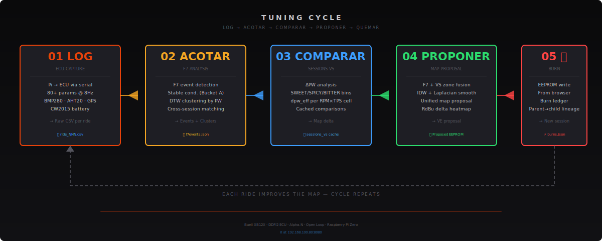

# Buell XB12X — DDFI2 Datalogger + AI Tuning Platform

> **LOG → ACOTAR → COMPARAR → PROPONER → QUEMAR**  
> Raspberry Pi · Python 3 · Delphi DDFI2 ECU · Alpha-N · Open Loop  
> **v2.7.130** — 13 Jun 2026 · 284 changelog entries · ~13K lines Python + JS

<p align="center">
  
</p>

---

## What this project is

A **Raspberry Pi datalogger + web dashboard** for tuning a **Buell XB12X** with a Delphi DDFI2 ECU.
No dyno needed — tuning is entirely data-driven from real street rides.

The Pi connects to the ECU via serial (CH343P USB-Serial, 9600 8N1), reads 80+ parameters at 8Hz,
and presents a full tuning dashboard accessible from any browser.

<p align="center">
  
</p>

---

## The Tuning Cycle

### LOG — Capture
Pi connects to the ECU via serial at 9600 8N1 and logs 80+ parameters (RPM, TPS, PW, spark, VSS, CLT, MAT, etc.) at 8Hz. Sensors add barometric pressure, temperature, humidity, battery level, and GPS position. Each ride is saved as a raw CSV.

### ACOTAR — F7 Analysis
F7 algorithm detects stable-condition events (Bucket A) and WOT transitions using rolling standard deviation over 3s windows. Events are clustered by Dynamic Time Warping (DTW) on the PW curve and cached per ride. Cross-session matching enables comparing the same event type across different map versions.

### COMPARAR — Sessions VS
Cross-session comparison engine: for every RPM×TPS cell, computes ΔPW (difference in injector pulse width) between session A and B. Classifies cells as SWEET (leaner, efficient), SPICY (richer, performance), or BITTER (no data). Results feed into the FASE 6 map proposal engine.

### PROPONER — Map Proposal
FASE 6 engine fuses F7 events with Sessions VS data using Inverse Distance Weighting (IDW) + Laplacian smoothing. Generates a unified map proposal visualized as an RdBu delta heatmap with Smoothed/Raw/Confidence/Source views. Proposals are cached per session pair.

### QUEMAR — Burn
EEPROM changes are burned directly from the browser. The **Burn Ledger** (VDYNO Phase V0) records every burn with parent→child tune checksum lineage, exact cell diffs, maps touched, and verification status. Each burn creates a new session, making the full tuning history traceable.

---

## Changelog Summary (Recent Key Versions)

| Version | Date | Highlights |
|---------|------|-----------|
| **v2.7.130** | 2026-06-13 | Fixed fuel status poller in history view (JS Robustness) |
| **v2.7.129** | 2026-06-13 | Removed dead saveObj() JS function (cross-AI dead-code audit) |
| **v2.7.128** | 2026-06-13 | Fixed real logger version detection + per-ride version tracking |
| **v2.7.127** | 2026-06-11 | Fenced power-off shutdown steps so Pi always powers off |
| **v2.7.126** | 2026-06-11 | Fixed 3D GPS track mirror (north axis sign) |
| **v2.7.125** | 2026-06-11 | Rotating 3D GPS track view in Mapa subtab (canvas-only engine) |
| **v2.7.123** | 2026-06-11 | Burn ledger — burns.json lineage + GET /burns + VE tab history |
| **v2.7.119** | 2026-06-11 | Graf chart presets: 5 tuning-oriented signal groups |
| **v2.7.118** | 2026-06-11 | Lambert shading + real camera zoom in tuner 3D surfaces |
| **v2.7.112** | 2026-06-10 | **Process isolation** — ECU serial + CSV moved to subprocess |
| **v2.7.111** | 2026-06-10 | Unk63 byte expanded to 8 bit columns; dead bytes removed |
| **v2.7.110** | 2026-06-09 | Removed dead consolidated.csv (181 MB freed) |
| **v2.7.109–106** | 2026-06-09 | Handler extraction: eeprom, wifi, gps, tuner, system, rides, fuel, sessions |
| **v2.7.105** | 2026-06-09 | Graphify code analysis — DashboardHandler refactor planned |
| **v2.7.103** | 2026-06-08 | AE% (Accel_Corr) added to CORRECCIONES COMBUSTIBLE chart |
| **v2.7.101** | 2026-06-08 | Reserve-aware fuel calibration + onboarding banner |
| **v2.7.83–85** | 2026-06-07 | Fuel tracking system: full tank reset, ride consumption, header fuel bar |

Full history: **[CHANGELOG.md](CHANGELOG.md)** (284 entries, 166 KB)

---

## Web Dashboard Pages

| Page | Route | Purpose |
|------|-------|---------|
| **Dashboard** | `/` | Live ECU data, VE heatmap, Fuel tracker, Config, WiFi/Network |
| **Session Events** | `/session_events` | F7 event detection, DTW clustering, cross-session matching |
| **Sessions VS** | `/sessions_vs` | Cross-session cell comparison (SWEET/SPICY/BITTER) |
| **Sessions Launch** | `/sessions_launch` | Launch detection and analysis |
| **Tuner** | `/tuner` | Map viewer/editor, 3D fuel/spark visualization |
| **Fuel** | `/fuel` | Fill-up tracking, consumption, range estimation |
| **Error Log** | `/errorlog_viz` | Diagnostic tool for serial errors and ECU events |

<p align="center">
  
</p>

---

## Architecture

### Hardware

| Component | Detail |
|-----------|--------|
| **Bike** | Buell XB12X (2009), 1203cc Thunderstorm V-Twin |
| **ECU** | Delphi DDFI2 (BUEIB), Alpha-N fueling, Open Loop |
| **Logger** | Raspberry Pi at 192.168.100.80, port 8080 |
| **Serial** | CH343P USB-Serial, 9600 8N1 |
| **Sensors** | BMP280 (baro/temp), AHT20 (humidity), CW2015 (battery), UBX GPS |

### Software Modules

```
main.py                          — Entry point: sensors, sysmon, web, network
+-- ecu/logger_process.py        — Subprocess: ECU serial + CSV logging
+-- ecu/connection.py            — DDFI2 serial protocol
+-- ecu/protocol.py              — PDU decode: 80+ RT variables
+-- ecu/eeprom.py                — EEPROM decode/encode (BUEIB)
+-- ecu/session.py               — Ride recording, CellTracker
+-- web/server.py                — HTTP server + REST endpoints
+-- web/handlers/                — 8 handler mixins
+-- web/f7.py                    — F7 event detection + DTW
+-- web/vs_engine.py             — Sessions VS comparison
+-- web/launch.py                — Launch detection
+-- web/gear_detect.py           — Post-ride gear detection
+-- web/burn_ledger.py           — VDYNO burn records
+-- web/static/app.js            — Frontend JS (3,048 lines)
+-- gps/reader.py                — UBX GPS serial reader
+-- sensors/                     — AHT20, CW2015
+-- network/manager.py           — WiFi/hotspot management
+-- docs/                        — Architecture docs, assets
```

### Design System

- **Dark theme**: `#0a0a0b` background, `#111114` panels
- **Accent**: Orange-red `#e8420a`
- **Typography**: Share Tech Mono (UI), Barlow Condensed (body)
- **Charts**: Canvas 2D only, no charting libraries

See [DESIGN.md](DESIGN.md) for full design tokens.

---

## AI Agent System

Two AI agents work in parallel:

| Agent | Role | File |
|-------|------|------|
| **Claude Code** | Implementer — writes and commits all code | `CLAUDE.md` |
| **freebuff** | Analyst + validator — researches, audits | `FREEBUFF.md` |

**Workflow:** User → freebuff (research) → Claude (commit) → freebuff (audit) → PASS/FAIL

---

## Quick Start

```bash
ssh pi@192.168.100.80
cd /home/pi/buell
nohup python3 main.py --port /dev/ttyECU --sessions-dir /home/pi/buell/sessions --buell-dir /home/pi/buell > /tmp/buell.log 2>&1 &
curl -s http://localhost:8080/live
```

Open **http://192.168.100.80:8080** in your browser.

---

## Key Technical Decisions

- **Alpha-N fueling**: TPS + RPM only, no MAP sensor. Do NOT normalize PW by baro.
- **Open Loop**: O2 disconnected. EGO_Corr = AFV = 100 always. Tuning via VE tables.
- **Process isolation**: ECU logging in subprocess — dash crashes can't stop CSV.
- **IPC**: `/tmp/buell` tmpfs with atomic file writes.
- **Handler mixins**: DashboardHandler refactored into 8 mixins.
- **No charting libraries**: All charts are custom Canvas 2D.
- **VDYNO**: Virtual dyno program with burn ledger, verdicts, evidence-based proposals.

---

## Documentation

| Document | Description |
|----------|-------------|
| [CHANGELOG.md](CHANGELOG.md) | Full version history (284 entries) |
| [ARCHITECTURE.md](ARCHITECTURE.md) | Detailed architecture reference |
| [CLAUDE.md](CLAUDE.md) | Instructions for Claude Code AI agent |
| [FREEBUFF.md
